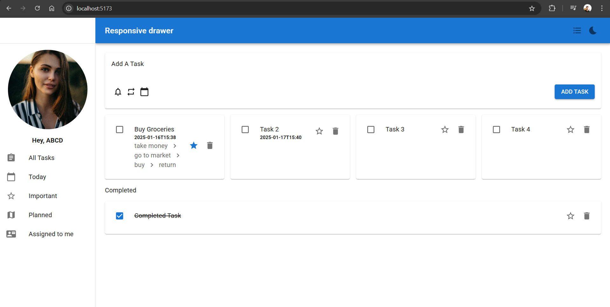

# QUADB-tech TODO-application

## Overview

The QUADB-tech TODO-application is a React-based application designed to help users efficiently manage their tasks. It features a user-friendly interface with Material-UI components, allowing users to add, update, delete, and filter tasks. The app supports persistent state through sessionStorage, ensuring that tasks remain available even after page reloads.

---

## Features

- **Task Creation**: Add tasks with details such as name, notes, importance, steps, reminders, due date, and repeat options.
- **Task List Display**: View tasks in either list or grid layout.
- **Task Filters**: Filter tasks by:
  - All tasks
  - Important tasks
  - Tasks due today
  - Planned tasks
- **Theme Toggle**: Switch between light and dark themes.
- **Task Management**:
  - Mark tasks as complete with a checkbox.
  - Mark tasks as important with a star icon.
  - Update task properties dynamically.
- **Persistent State**: Tasks and layouts are saved to sessionStorage to prevent loss on page reload.

---

Planned task are set to be those task that have dates other than today (current)

## Technologies Used

- **Frontend**:
  - React.js
  - Material-UI (MUI)
  - Grid2 for responsive layouts
- **State Management**:
  - Context API (Task Context, Theme Context, Layout Context, Filter Context)
- **Storage**:
  - sessionStorage for persistence

---

## Folder Structure

```
src/
|-- components/
|   |-- AddTaskForm.js          # Form to add tasks
|   |-- TaskList.js             # Component to display tasks
|   |-- FilterControls.js       # Filter selection UI
|-- context/
|   |-- TaskContext.js          # Manages task state
|   |-- ThemeContext.js         # Manages light/dark themes
|   |-- LayoutContext.js        # Manages layout (list/grid)
|   |-- FilterContext.js        # Manages task filters
|-- App.js                      # Main application file
```

---

## Installation

1. Clone the repository:

   ```bash
   git clone https://github.com/your-repo/task-management-app.git
   ```

2. Navigate to the project directory:

   ```bash
   cd task-management-app
   ```

3. Install dependencies:

   ```bash
   npm install
   ```

4. Start the development server:
   ```bash
   npm start
   ```

---

## Usage

1. Open the app in your browser at `http://localhost:5173/`.
2. Add a task using the "Add Task" form.
3. Use the layout toggle to switch between list and grid views.
4. Use the filter controls to filter tasks based on criteria.
5. Mark tasks as complete or important using the checkboxes and star icons.

---

## Screenshots

Add screenshots of your application to showcase its features. For example:

Task List in Light Mode



Task List in Dark Mode


